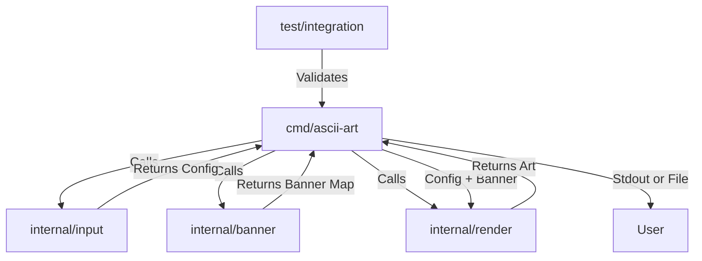

# System Architecture

## Overview
The ASCII Art Generator follows the **Standard Go Project Layout**, ensuring scalability, maintainability, and clear separation of concerns. This structure mimics professional production-grade CLI applications.

## Component Diagram



## Modules

### 1. Main Controller (`cmd/ascii-art/main.go`)
*   **Responsibility:** Orchestration.
*   **Flow:**
    1.  Calls `Input Parser` to validate and sanitize arguments.
    2.  Calls `Banner Loader` to read the font file.
    3.  Passes the string and banner to the `Renderer`.
    4.  Prints the result to the console.

### 2. Input Layer (`internal/input`)
*   **Responsibility:** Validation and Sanitization.
*   **Key Functions:**
    *   `ParseInput(args []string) (string, error)`: Checks argument count, handles escape sequences (converting literal `\n` to byte `10`), and validates ASCII range (32-126).

### 3. Data Layer (`internal/banner`)
*   **Responsibility:** Data Access.
*   **Key Functions:**
    *   `LoadBanner(filename string) (Banner, error)`: Reads the file, splits by double newline (or specific separator), and maps runes to 8-line string slices.

### 4. Logic Layer (`internal/render`)
*   **Responsibility:** Core Logic.
*   **Key Functions:**
    *   `Render(input string, b Banner) string`: Iterates through the input string. For each line of input, it constructs 8 lines of output by concatenating the slices from the `Banner` map.

### 5. Shared Models (`pkg/model`)
*   **Responsibility:** Data Contracts.
*   **Data Structure:**
    *   `type Banner map[rune][]string`

## Directory Structure
```
.
├── cmd/
│   └── ascii-art/
│       └── main.go           # Application entry point (wiring only)
├── internal/                 # Private application code (not importable by others)
│   ├── banner/               # Banner loading and parsing logic
│   │   ├── loader.go
│   │   └── loader_test.go
│   ├── input/                # Input validation and sanitization
│   │   ├── parser.go
│   │   └── parser_test.go
│   └── render/               # ASCII art generation logic
│       ├── renderer.go
│       └── renderer_test.go
├── pkg/                      # Public library code (safe for external use)
│   └── model/                # Shared data structures (e.g., Banner type)
├── test/                     # External integration tests
│   ├── golden/               # Golden file test cases (.txt files)
│   └── integration_test.go   # "The Tester" - runs binary against golden files
├── docs/                     # Project documentation
│   ├── architecture.md       # This file
│   ├── prd.md                # Product Requirements Document
│   ├── tasks/                # Task breakdown (task_01, task_02, etc.)
│   └── logs/                 # AI interaction logs (ai.log)
├── assets/                   # Static assets
│   └── banners/              # ascii_library.txt (standard), shadow.txt, etc.
├── go.mod
└── Makefile                  # Build and test automation
```